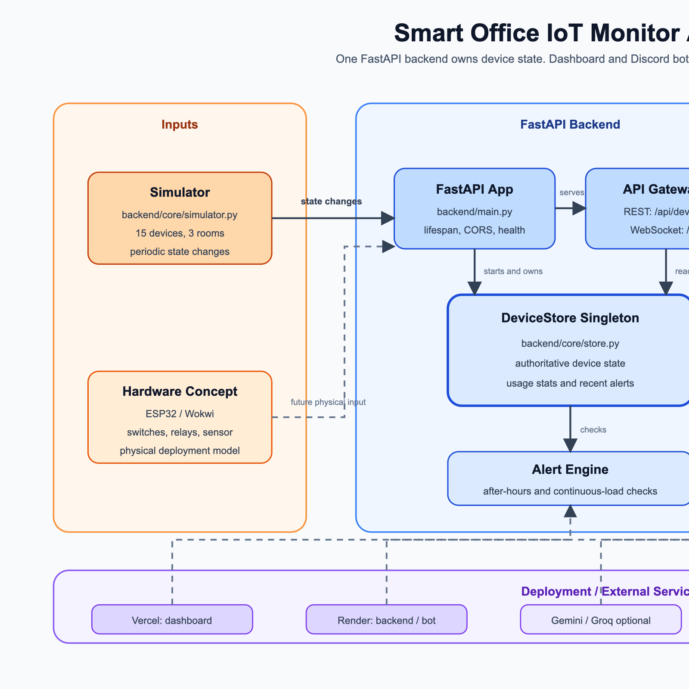

# System Architecture - Smart Office IoT Monitor

This diagram shows the project at a presentation level: the simulator and hardware concept feed one FastAPI backend, the backend owns all device state, and the dashboard plus Discord bot consume that same source of truth.



## Main Components

| Layer | Component | Role |
|---|---|---|
| Inputs | Simulator | Generates live state changes for 15 devices across 3 rooms. |
| Inputs | ESP32 / Wokwi concept | Documents the physical deployment model: switches, relays, and current sensing. |
| Backend | FastAPI app | Starts the simulator, exposes health checks, configures CORS, and owns API wiring. |
| Backend | API gateways | Provides REST endpoints under `/api/devices` and WebSocket streaming on `/ws`. |
| Backend | DeviceStore singleton | Single source of truth for current device state, usage stats, and recent alerts. |
| Backend | Alert engine | Checks after-hours usage and continuous-load conditions. |
| Consumers | React dashboard | Uses WebSocket for live updates and REST for initial/fallback refreshes. |
| Consumers | Discord bot | Uses REST commands and alert polling to report status in Discord. |

## Flow Summary

1. The simulator mutates device state inside the FastAPI process.
2. All device reads and writes go through `DeviceStore`.
3. The WebSocket endpoint streams snapshots, device updates, and alerts to the dashboard.
4. REST endpoints serve dashboard fallback reads and Discord bot commands.
5. The hardware circuit is documented as the physical model, but the current app uses the Python simulator as its live input.

## Files

- Rendered PNG: [`architecture.png`](./architecture.png)
- Rendered SVG: [`architecture.svg`](./architecture.svg)
- Graphviz source: [`architecture.dot`](./architecture.dot)

## Regeneration

The committed SVG is hand-authored for a cleaner presentation view. To regenerate the PNG on macOS:

```bash
sips -s format png diagrams/architecture.svg --out diagrams/architecture.png
```

If Graphviz is installed, `architecture.dot` can also be rendered as an alternate detailed view:

```bash
dot -Tpng diagrams/architecture.dot -o diagrams/architecture.png
dot -Tsvg diagrams/architecture.dot -o diagrams/architecture.svg
```
